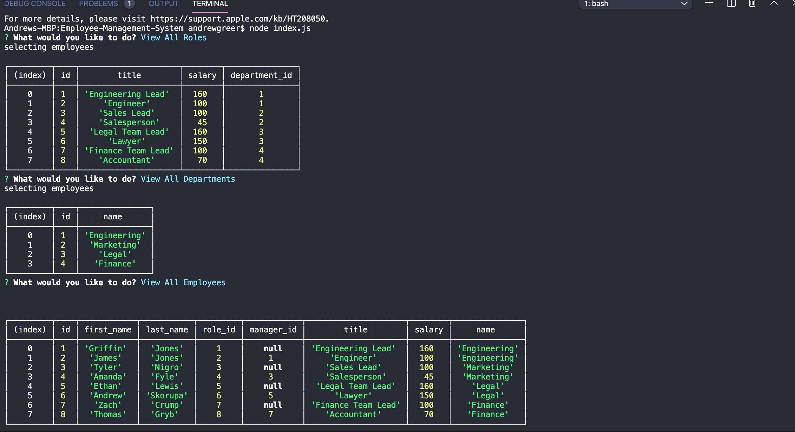
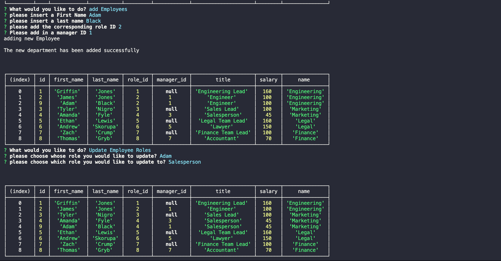
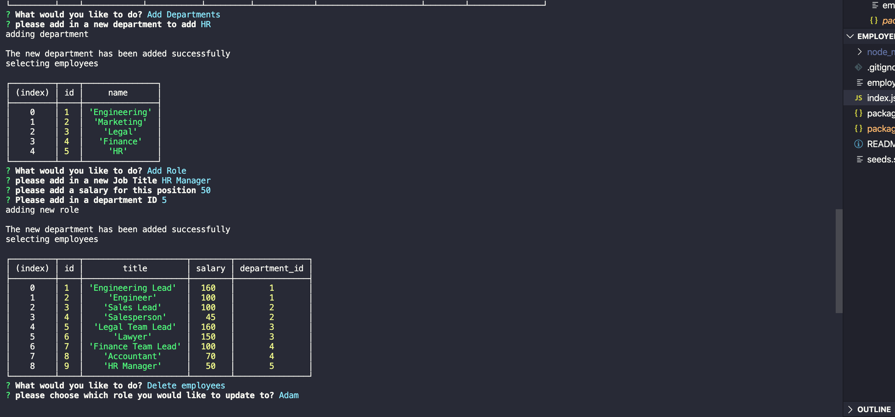
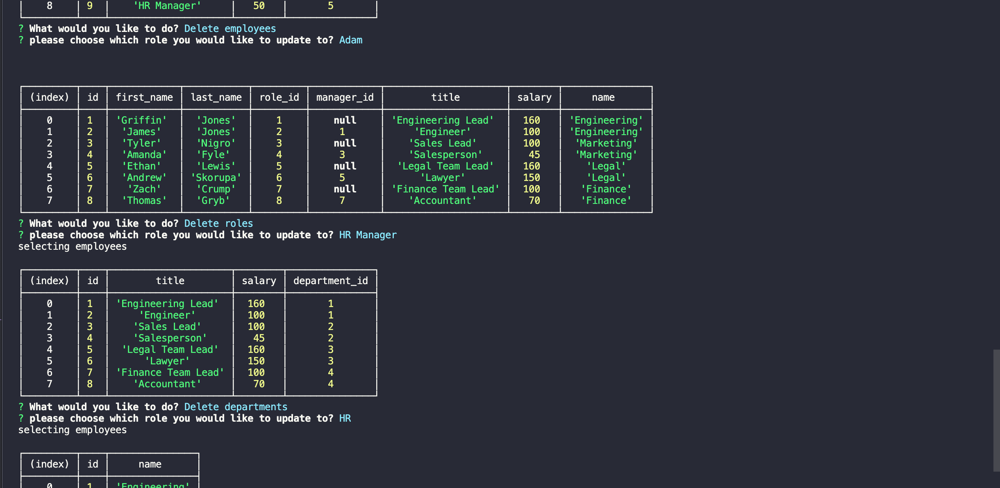
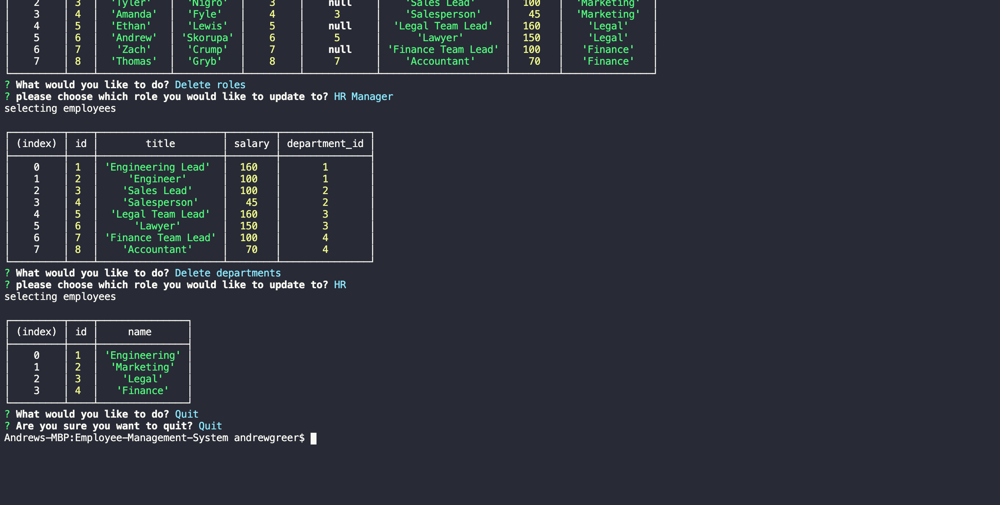

# Employee-Management-System

## Description

This is the README for the Employee Management System (employee tracker). This applciaiton allows a user to see departments, roles, and employees, create departments, roles, and employees, delete departments, roles, and employees, as well as updating an employee's role. 

## Table of Contents

- [Installation](#installation)
- [License](#license)
- [Usage](#usage)
- [Contributing](#contributing)
- [Tests](#tests)
- [Questions](#questions)

## Installation

run NPM i

## License

## Usage

YouTube Demonstration Link: https://www.youtube.com/watch?v=gRqd3CPFIeU&feature=youtu.be

Demp, here are screenshots showing hte CLI app working in the terminal top down

## Contributing

Andrew Greer

## Tests

run NPM i

## Questions

Email: andrewgreer2015@gmail.com

Github: andrewpaulgreer
